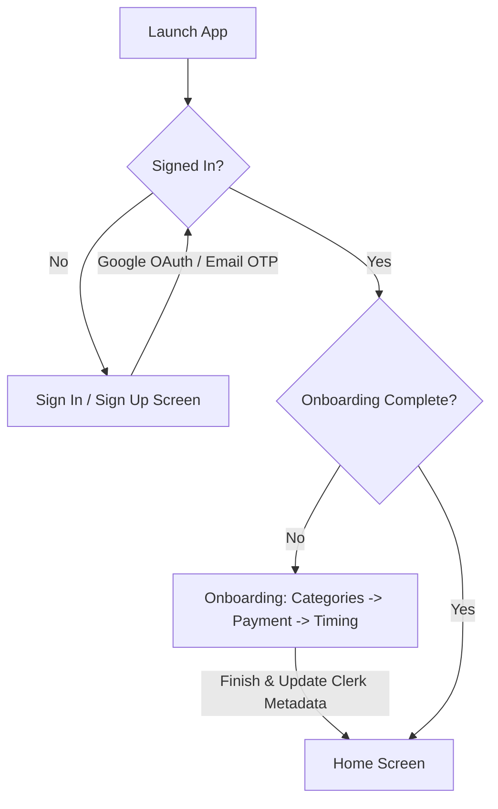

# Aterna App

Accountability Partner App · Expo + Clerk + Supabase + Razorpay + Gemini AI

---

## 1. Overview
Aterna is a mobile-first accountability platform that combines real financial commitment contracts, AI coaching, and human peer pairing to help users follow through on their daily goals. 

Users declare a goal each morning (via voice or text), stake a small amount of real money (Razorpay), and check in at night. If they fail, the money goes to their selected consequence. AI provides a personalized debrief using the Gemini API. Once a week, users are matched with a peer for a 5-minute async video exchange (body doubling).

---

## 2. Technology Stack
- **Core Framework:** React Native / Expo (SDK 54)
- **Navigation & Routing:** Expo Router (file-based routing)
- **Authentication:** Clerk Expo (`@clerk/clerk-expo`)
- **Database & Storage:** Supabase (`@supabase/supabase-js`)
- **AI Coaching & SMART Rewrites:** Gemini API (`@google/generative-ai`)
- **Escrow & Payments:** Razorpay (`react-native-razorpay`)
- **Styling:** NativeWind (Tailwind CSS for React Native)
- **Animations:** React Native Reanimated

---

## 3. Directory Structure
```
aterna/
├── app/                        # Expo Router Screens & Routing Layouts
│   ├── _layout.tsx             # Root layout & Navigation RouteGuard
│   ├── index.tsx               # Entrypoint & Redirect Logic
│   ├── sso-callback.tsx        # OAuth/SSO callback handler
│   ├── (auth)/                 # Auth layout group (no tab bar)
│   │   ├── _layout.tsx
│   │   ├── sign-in.tsx         # Google Sign-in screen
│   │   ├── sign-up.tsx         # Email Sign-up screen
│   │   ├── verify-email.tsx    # Email OTP Verification screen
│   │   └── onboarding/         # Onboarding flow
│   │       ├── _layout.tsx
│   │       ├── categories.tsx  # Step 1: Preferred goal categories
│   │       ├── payment.tsx     # Step 2: Connect payment
│   │       └── timing.tsx      # Step 3: Alarm schedule setup
│   └── (app)/                  # Main app layout group (tab navigation)
│       ├── _layout.tsx         # Bottom tab bar configuration
│       ├── home.tsx            # Today's goal card & streak ring
│       ├── discover.tsx        # Public feed & social feed
│       ├── partner.tsx         # Peer matching & video exchange inbox
│       ├── insights.tsx        # Success metrics & charts
│       └── profile.tsx         # Settings & personal details
├── components/                 # Reusable UI & Domain Components
│   ├── ui/                     # Premium themed UI elements (Button, Card, etc.)
│   ├── goal/                   # Goal cards, SubTaskList, StreakRing
│   └── checkin/                # Evening Checkin button controls
├── constants/
│   └── theme.ts                # App HSL/Hex color palette tokens
├── lib/
│   ├── supabase.ts             # Supabase storage adapter client
│   ├── clerk.ts                # SecureStore Clerk token cache
│   ├── notifications.ts        # Expo push notifications handlers
│   └── haptics.ts              # Haptic feedback response engine
├── types/
│   └── database.ts             # Strict TypeScript models matching DB schema
└── tsconfig.json               # Strict compiler rules configuration
```

---

## 4. Flow & Routing Architecture



### Authentication Flows
1. **Email / Password Sign-Up:**
   - User inputs details on `sign-up.tsx`.
   - Clerk initiates email verification and sends a 6-digit OTP code to their Gmail.
   - User inputs the code on `verify-email.tsx`.
   - On successful verification, the session becomes active, and `RouteGuard` automatically channels them to the **Onboarding Flow**.
2. **Google OAuth Sign-In:**
   - User taps "Continue with Google" on `sign-in.tsx`.
   - App calls Clerk's `startOAuthFlow` with the in-app browser.
   - User authenticates via Google and is redirected back to the app (`sso-callback.tsx`).
   - The session becomes active, and `RouteGuard` channels them to the **Onboarding Flow** (if new user) or the **Home Screen** (if returning user).

### Onboarding Flow (3 Steps)
1. **Categories:** User selects their primary accountability focuses (e.g. Work, Health).
2. **Payment:** Connects Razorpay for goal staking commitments.
3. **Timing:** Configures morning goal declaration alarm and evening check-in alert times.
4. **Completion:** On Step 3 timing completion, the app updates the user's Clerk `unsafeMetadata` with `onboardingComplete: true`, locking their profile status and letting them proceed into the dashboard.

---

## 5. Development & Configuration
1. Install dependencies:
   ```bash
   npm install
   ```
2. Configure `.env` in the root of the project:
   ```env
   EXPO_PUBLIC_CLERK_PUBLISHABLE_KEY=pk_test_...
   EXPO_PUBLIC_SUPABASE_URL=https://...
   EXPO_PUBLIC_SUPABASE_ANON_KEY=...
   EXPO_PUBLIC_RAZORPAY_KEY_ID=rzp_test_...
   RAZORPAY_KEY_SECRET=...
   GEMINI_API_KEY=...
   ```
3. Run the development server:
   ```bash
   npx expo start -c
   ```
